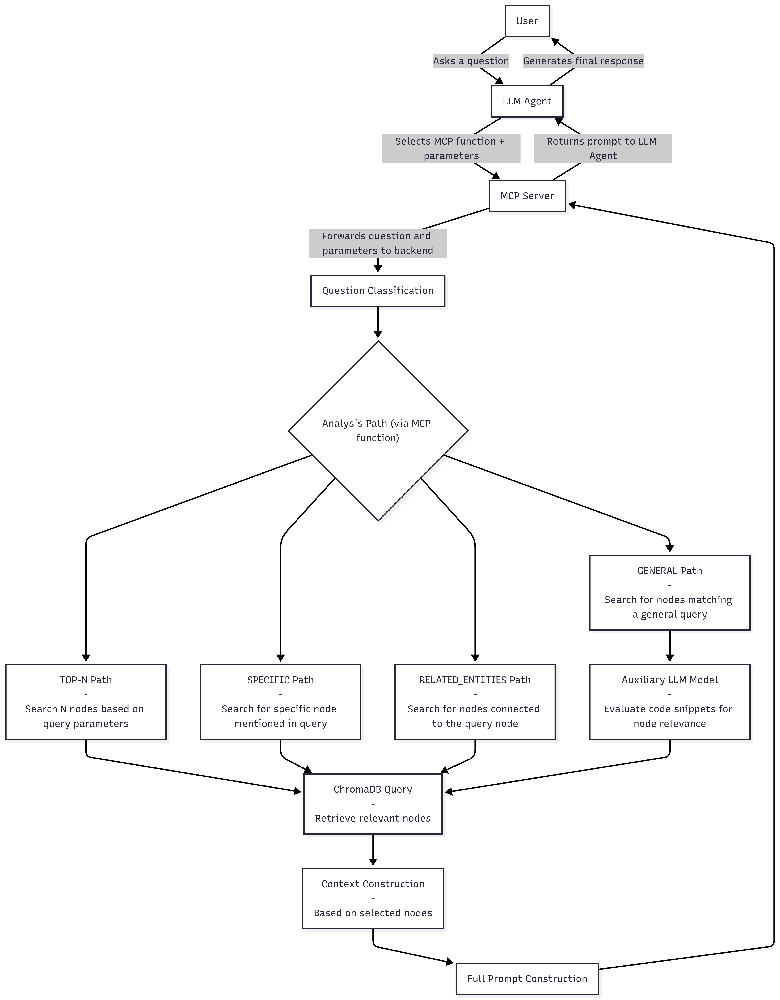

# A System Supporting Code Comprehension Based on Large Language Models and a Semantic Code Graph

This system is a tool designed for professional programmers to better understand large, evolving projects, and for novice programmers to learn coding more easily based on existing projects. To provide wider context, it utilizes a Semantic Code Graph (SCG), specifically relying on the [scg-cli tool](https://github.com/VirtusLab/scg-cli) for generation.

The system functions as an MCP Server that can be integrated with a client tool of the user's choice. It currently supports code written in Scala and Java.

## System Versions

### Branch `main`
Intended for general use. It logs errors and events to the `server_debug.log` file.

### Branch `fast-api`
Intended for testing and further development.
To run this version, use:
```bash
uvicorn src.app.main:app --reload

```

## Quick Start

For quick access to a large project and to test the tool, download the project ZIP archive from: [Google Drive Link](https://drive.google.com/drive/folders/16fs8QkI0nZXWuGKOfxYF68WVpUknVugd?usp=sharing).

The archive contains:

* A large project: [Apache Spark 3.3.0](https://github.com/apache/spark/releases/tag/v3.3.0)
* A small testing project: [test_project](https://github.com/jciura/test_project)

**Setup:**

1. Both projects are located in the `[projects](/projects)` folder.
2. Generated data for both projects is located in the `[data/graph](/data/graph)` folder.
3. **Note:** If you encounter issues, copy the `chroma_storage` folder located there to the `[data/embeddings](/data/embeddings)` folder.
4. To adapt the tool to the analyzed project, modify `COMBINED_MAX` in `[src/core/config.py](/src/core/config.py)`:
* For **Apache Spark 3.3.0**, set it to: `1187856`
* For **test_project**, set it to: `4256`


*Note: The `COMBINED_MAX` value is calculated during embedding generation. Since we are using pre-generated data, this step must be done manually.*

## MCP Server Methods

The MCP Server provides 4 main methods to retrieve code context:

1. **`ask_specific_nodes`** – Retrieves context for specific node(s) mentioned in the question.
2. **`ask_top_nodes`** – Retrieves context for questions related to ranking nodes.
3. **`ask_general_question`** – Retrieves context for questions that do not mention specific nodes.
4. **`list_related_entities`** – Lists all entities related to the entity specified in the question.

For a detailed explanation of how these methods work, please read [AGENT.md](https://www.google.com/search?q=src/clients/AGENT.md).

## Basic System Flow



## How to Run

1. Download the modified CLI from https://github.com/jciura/scg-cli-modified/tree/main and add the `\bin` folder to your system's PATH environment variable.
2. Generate `.semanticgraph` files, the SCG graph file, metrics, and embeddings for your project using `app\main_runner.py` with the argument:
```bash
--project path_to_project

```
*Note: This may take a while for large projects. If the project is written in Scala, `.semanticgraph` files need to be generated by the user manually first. See instructions [here](https://github.com/VirtusLab/scg-cli?tab=readme-ov-file#generating-project-scg-metadata).*
3. Connect the MCP Server to an Agent responsible for choosing the MCP function, its parameters, and formulating the question. A general configuration to add the MCP Server is shown below:
```json
{
  "mcpServers": {
    "scg-context": {
      "command": "python",
      "args": ["{PROJECT_PATH}/src/clients/mcpserver.py"]
    }
  }
}

```
4. Create a `.env` file in the project root:
```bash
cp .env.example .env
```
5. Fill in your API keys in the `.env` file.
6. Start asking questions related to the project.
