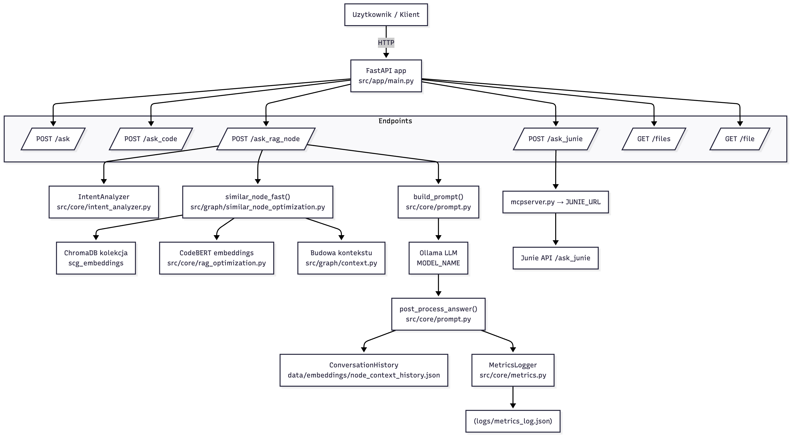
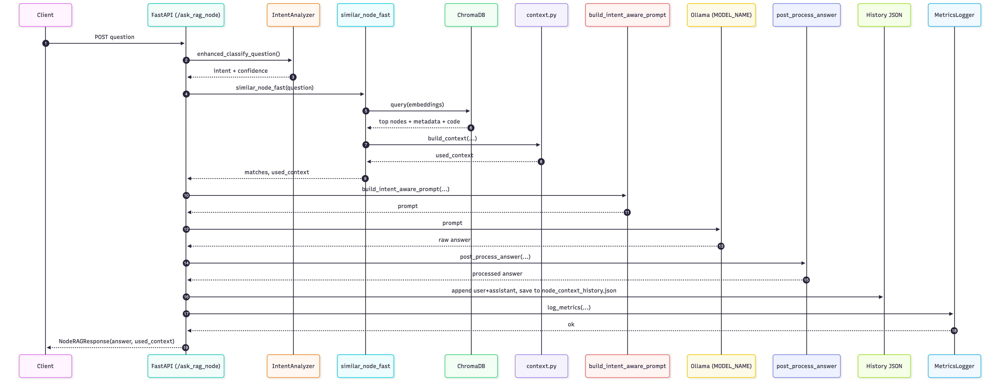

# System wspierający zrozumienie kodu w oparciu o modele językowe i semantyczny graf kodu

1. https://ollama.com
2. terminalu: ollama run codellama:7b-instruct - uruchomienie modelu
3. scg-cli zmodyfikowany: https://github.com/jciura/scg-cli-modified

4. scg-cli generate <Sciezka> - najpierw generuje się zawsze dla projektu pojedyncze grafy semantyczne, bez tego reszata
   nie dziala
5. scg-cli export -g SCG -o gdf <Sciezka> - export całego grafu do pliku .gdf
6. scg-cli summary -g SCG <Sciezka> - szybkie podsumiwanie projektu
7. scg-cli crucial <Sciezka> -n k; k - ile bierzemy węzłów o najwyższych wartościach, raczej chcemy podawać all, żeby
   każdy embedding miał te wartości, a nie tylko wybrane
8. scg-cli partition n; podaje jak podzielić projekt na n partycji
9. Gephi - plik do otwierania plików .gdf - można użyć ale raczej bezużyteczny - nie na tym nie widać
10. Przy zmianie scg-cli wywołać: sbt clean universal:packageBin, żeby wygenerować nową paczkę
11. Na razie testowy projekt to projekt w springu do zapisywania się na webinary i zarządzania
    nimi: https://github.com/jciura/test_project - wrzucić do projects i zmienić
    nazwę na test; Na razie nie trzeba pobierać potrzebne pliki z scg-cli są wygenerowane w /projects 

12. Link do wtyczki do intellij - https://github.com/jciura/CodeAssistant - trzeba uruchomić to w intellij, on
     włączy nową instancję intellij, gdzie trzeba otworzyć projekt i wtyczka jest tam zaimportowana - najniższa ikona po prawej stronie.


## Działanie systemu

### Przygotowanie danych (wykonywane raz)

1. **load_graph.py** – ładowanie plików GDF z grafem kodu oraz metryk.  
2. **question_embedding.py** – obliczanie embeddingów klasyfikatora pytań na danych.  
3. **generate_embeddings_graph.py** – generowanie embeddingów dla wszystkich węzłów grafu.  
4. **ChromaDB** – baza, w której przechowywane są embeddingi i metadane węzłów.  

### Obsługa pytania użytkownika

1. **main.py** – odbiera pytanie użytkownika przez endpoint `/ask_rag_node`.  
2. **prompts.py** – analiza intencji użytkownika (`analyze_user_intent`) - klasyfikuje pytanie na kategorię (exception, usage, definition, implementation, testing).
3. **similar_node_optimization.py** – wyszukiwanie i budowa kontekstu:  
   - **retriver.py** – wyciąganie kluczowych terminów z pytania,  
   - **generate_embeddings_graph.py** – tworzenie embeddingu dla pytania,  
   - **rag_optimization.py** – udostępnia model CodeBERT,  
   - **ChromaDB** – znajduje podobne węzły kodu,  
   - **context.py** – filtrowanie kontekstu na podstawie kategorii pytania
4. **prompts.py** – budowanie prompta (`build_prompt`) z uwzględnieniem kategorii i historii konwersacji.
5. **models.py** – walidacja danych i zarządzanie historią konwersacji.  
6. **main.py** – wysyła kontekst + pytanie do Ollama API.  
7. **prompts.py** – post-processing odpowiedzi.
8. **main.py** – zwraca odpowiedź użytkownikowi.


## Architektura systemu
Poniżej przedstawiono główne komponenty aplikacji:



---

## Sekwencja zapytania `/ask_rag_node`
Schemat przepływu danych i zapytań:


### Junie

1. W ustawieniach Tools>Junie>MCP Settings dodać coś takiego
   (zmienić command i args na lokalizacje na komputerze):

   {
   "mcpServers": {
   "junie-context": {
   "command": "C:\\Users\\chinc\\PycharmProjects\\inzynierka\\.venv\\Scripts\\python.exe",
   "args": [
   "C:\\Users\\chinc\\PycharmProjects\\inzynierka\\mcpserver.py"
   ],
   "shell": true,
   "captureOutput": true
   }
   }
   }
2. Junie wystartuje program mcpserver.py
3. Pytanie układa się w sposób: /junie-context ask_junie {Reszta pytania (trzeba mu napisać żeby zapytał serwer mcp)}
4. Na razie zwraca błąd enkapsulacji danych
5. Nie wiem czy ma to sens bo robi to co my - przeszukuje cały projekt, ale jak mu damy kontekst to może minimalnie
   przyśpieszy ale możemy to zrobić bez tego pośrednika

## Przykłady pytań 
- Describe Category class
- How does method getSortedWebinars work?
- where is method enrollStudentIntoWebinar used?
- What custom exceptions are in WebinarService class?
- What tests exist for WebinarService class?

## Wymagania
- Python 3.10+
- [Ollama](https://ollama.ai/) (`llama3.1:8b`)
- Zależności z pliku `requirements.txt`:
  ```bash
  pip install -r requirements.txt
  
## Zmiana na uv
1. Usunąć venv 
2. Zrobić 
```bash
uv sync 
```
3. Aktywować środowisko 
4. Uruchomić aplikacje 
```bash
   uvicorn src.app.main:app --reload
```

# Claude

1. DARMOWY CLAUDE ma jakis limit pytań
2. Pobrać z https://www.claude.com/download
3. W settings>Developer>Edit Config
4. Trzeba edytować plik claude_desktop_config:
   ```json
   {
   "mcpServers": {
    "scg-context": {
      "command": "C:/Users/chinc/PycharmProjects/inzynierka1/.venv/Scripts/python.exe",
      "args": ["C:/Users/chinc/PycharmProjects/inzynierka1/src/clients/mcpserver.py"],
      "docs": "C:/Users/chinc/PycharmProjects/inzynierka1/src/clients/AGENT.md"
    }
   }
   }

5. W command i args ścieżki do pythona i do mcpserver.py, a w docs ścieżka do pliku AGENT.md
6. Na razie daje strasznie duże parametry do pytań i je zmienia mimo wielu poleceń w AGENT.md by tego nie robił

## Linki 
https://medium.com/@med.el.harchaoui/rag-evaluation-metrics-explained-a-complete-guide-dbd7a3b571a8
